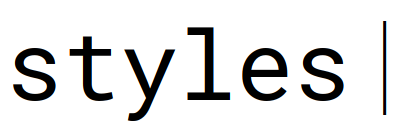

# Heading 1

## Heading 2

### Heading 3

_italic_

<!-- *alternate italic* -->

**bold**

- you can do this:

  - **_bold & italic_**

<!-- ***alternate bold & italic*** -->

[link example](https://example.com/)

`monospace`

~~strikethrough~~

<u>underlined words</u> <!-- github exclusive kayaknya -->

téks leutik dihandap

téks leutik diluhur

<!-- ghaib -->

> Astagfirullah aya jurig

- [ ] task 1
- [x] task 2

| Left |
|------|

| Right |
|------:|

| Center |
|:------:|

| Akun   | Debit | Kredit |
|:------:|:-----:|-------:|
| Dirham | 50    |        |
|--------|------:|-------:|
| Dinar  | 50    |        |
| Token  | 50    |        |

| Akun   | Debit | Kredit |
|:------:|:-----:|-------:|
| Modal  |       | 100    |
|--------|------:|-------:|
| Simpanan Kiosk  |       | 50     |

> Wow [^1]

[^1]: Allah swt.'s quote
