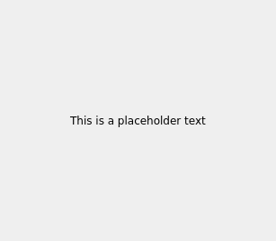
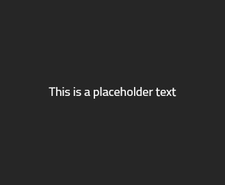
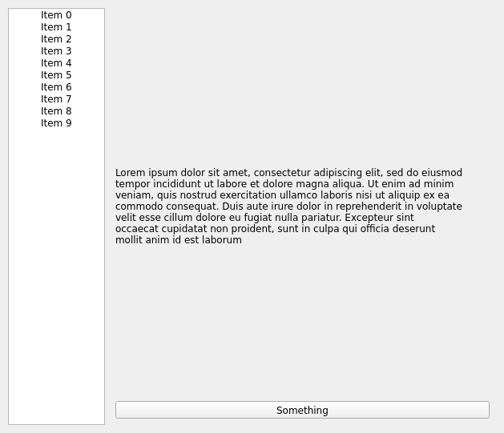
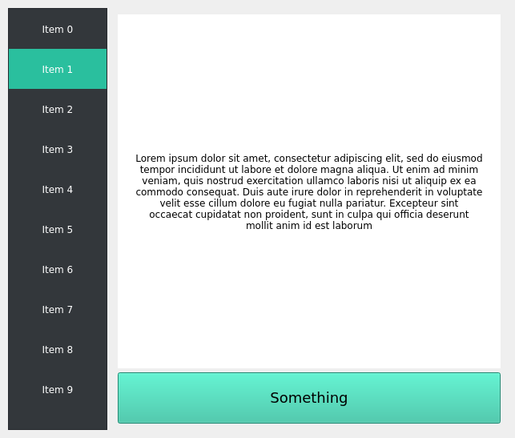
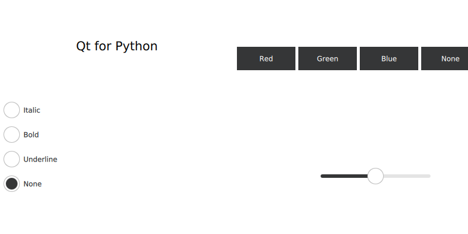

# Qt for Python

## Table of Contents

- [Qt for Python](#qt-for-python)
  - [Table of Contents](#table-of-contents)
  - [The difference of Qt, QML, and Widgets](#the-difference-of-qt-qml-and-widgets)
    - [Qt](#qt)
    - [QML](#qml)
  - [File Types](#file-types)
    - [.py](#py)
    - [.ui](#ui)
    - [.qrc](#qrc)
    - [.qml](#qml-1)
  - [Distributing Your Application to Other Systems/Platforms](#distributing-your-application-to-other-systemsplatforms)
    - [Reproducible deployment](#reproducible-deployment)
    - [Freezing Your Application](#freezing-your-application)
    - [Compiling Python](#compiling-python)
  - [Why Qt for Python?](#why-qt-for-python)
    - [Lowering the Qt Barrier](#lowering-the-qt-barrier)
    - [Shiboken](#shiboken)
  - [Your First QtWidgets Application](#your-first-qtwidgets-application)
  - [Signals and Slots (handling) / Using a Simple Button](#signals-and-slots-handling--using-a-simple-button)
  - [Signals and Slots (comprehensive)](#signals-and-slots-comprehensive)
    - [Signal Class](#signal-class)
    - [Slot Class](#slot-class)
    - [Overloading Signals and Slots with Different Types](#overloading-signals-and-slots-with-different-types)
    - [Specifying Signals and Slots by Method Signature Strings](#specifying-signals-and-slots-by-method-signature-strings)
  - [Creating a Dialog Application](#creating-a-dialog-application)
    - [Create the Widgets](#create-the-widgets)
    - [Create a layout to organize the Widgets](#create-a-layout-to-organize-the-widgets)
    - [Create the function to greet and connect the Button](#create-the-function-to-greet-and-connect-the-button)
    - [Complete code](#complete-code)
  - [Displaying Data Using a Table Widget](#displaying-data-using-a-table-widget)
  - [Displaying Data Using a Tree Widget](#displaying-data-using-a-tree-widget)
  - [Using `.ui` files from Designer or QtCreator with `QUiLoader` and `pyside6-uic`](#using-ui-files-from-designer-or-qtcreator-with-quiloader-and-pyside6-uic)
  - [Using `.qrc` Files (`pyside6-rcc`)](#using-qrc-files-pyside6-rcc)
    - [The `.qrc` file](#the-qrc-file)
    - [Generating the `.py` from `.qrc`](#generating-the-py-from-qrc)
    - [Usage in the code](#usage-in-the-code)
  - [Translating Applications](#translating-applications)
  - [Styling the Widgets Application](#styling-the-widgets-application)
    - [Qt Style Sheets](#qt-style-sheets)
  - [Your First QtQuick/QML Application](#your-first-qtquickqml-application)
  - [Python-QML integration](#python-qml-integration)
  - [More...](#more)
  - [How To Debug a C++ Extension of a PySide6 Application?](#how-to-debug-a-c-extension-of-a-pyside6-application)
  - [Source(s)](#sources)

## The difference of Qt, QML, and Widgets

### Qt

> Deleted because I summarized it incorrectly, read on [here](https://doc.qt.io/qtforpython/tutorials/pretutorial/whatisqt.html).

### QML

The elements that you can find in QML/Quick applications are focused on providing a more dynamic application infrastructure which different properties based in certain behaviors.

Even though QML has the motivation to provide interfaces with mobile devices, you can use it for Desktop applications, too.

> udah QML aja berarti
> Below texts are from Wikipedia, here's the [link](https://en.wikipedia.org/wiki/QML).

Qt Quick is used for mobile applications where touch input, fluid animations and user experience are crucial. QML is also used with Qt3D to describe a 3D scene and a "frame graph" rendering methodology.

A QML document describes a hierarchical object tree.

QML modules shipped with Qt include primitive graphical building blocks (e.g., Rectangle, Image), modeling components (e.g., FolderListModel, XmlListModel), behavioral components (e.g., TapHandler, DragHandler, State, Transition, Animation), and more complex controls (e.g., Button, Slider, Drawer, Menu).

These elements can be combined to build components ranging in complexity from simple buttons and sliders, to complete internet-enabled programs.

QML elements can be augmented by standard JavaScript both inline and via included .js files. Elements can also be seamlessly integrated and extended by C++ components using the Qt framework.

> Why python hasn't been developed for mobile apps? I will do it then

## File Types

There are many different file types that you will encounter while developing Qt for Python applications, ui, qrc, qml, pyproject, etc. Here you can find a simple explanation for each of them.

### .py

main file is .py

It is important to note that you can write applications only with Python files, without the need of .ui, .qrc, or .qml files, however using other formats will facilitate some processes, and enable new functionality to your applications.

> enable new functionality (kayaknya buat tajwid nya) (.ui, .qrc, or .qml)

### .ui

User Interface Definition File .ui

The pyside6-uic tool generates Python code from these .ui files, which you can import from your main files, so it is not necessary for you to include the .ui files in your deployed application.

> BASICALLY ada compiler buat .ui jadi .py file

### .qrc

List of binary files (XML file)

```html
<!DOCTYPE RCC><RCC version="1.0">
<qresource>
    <file>images/quit.png</file>
    <file>font/myfont.ttf</file>
</qresource>
</RCC>
```

pyside6-rcc tool generates Python code from these .qrc files. compiler, so qrc file doesn't to be in deployed app

> asyik

### .qml

Qt Modeling Language File

Graphical QML applications  (=/=) are not related to  Qt Widgets applications

usual setup of QML project is a Python file that loads the QML file

and optionally, elements defined in Python that are exposed to QML to be used.

QML Designer that is embedded in Qt Creator. (to write .qml file)

> Qml tools

there are commercial tools like Qt Design Studio that allow you to load designs from other design applications.

## Distributing Your Application to Other Systems/Platforms

The deployment process for Python applications is called, “freezing”, which is distributing your virtual environment content to other users.

> is it necessary to use poetry hook for exporting `requirements.txt`?

### Reproducible deployment

A common approach is to only provide a `requirements.txt` file,

### Freezing Your Application

This is the most common approach to distribute their applications and even though the code is still available for the end user, it is a bit more difficult to retrieve it.

### Compiling Python

Even though Python does not natively support to be compiled,

there are complementary tools that let you to achieve this.

You can check the Nuitka project to learn more.

> for what though?

## Why Qt for Python?

### Lowering the Qt Barrier

_Veteran C++ developers will have no problem with setting up a Qt application from scratch, or even manage to understand a different code base written with Qt. In addition, many teams are multidisciplinary, and other project/company developers might not be fluent in C++._

_Python has been luring people into programming, and for the same reason it’s not uncommon that even people with a different background are able to write code, meaning that different teams are enabled to speak “the same language”._

Creating Qt applications in Python requires only a few lines of code,

and not much configuration is required to execute it.

Some Python code example of a simple hello world application:

```python
import sys
from pyside6.QtWidgets import (QApplication, QMainWindow,
                               QPushButton)

class MainWindow(QMainWindow):
    def __init__(self, parent=None):
        QMainWindow.__init__(self, parent)
        self.button = QPushButton("My Button", self)
        self.button.clicked.connect(self.handleButton)

    def handleButton(self):
        self.button.setText("Ready")

if __name__ == "__main__":
    app = QApplication([])
    mainWindow = MainWindow()
    mainWindow.show()
    sys.exit(app.exec())
```

It’s fair to say that most of the boilerplate code is provided by many good IDEs, like QtCreator, but using external tools certainly requires some practice to use them and get familiarized.

> That is informative.

### Shiboken

Together with the bindings, Qt for Python provides our binding generator, Shiboken

_Generating bindings between two languages it nothing new, but it has always been a non-trivial task, mainly for being as-compatible-as-possible when using external modules/libraries in your project._

Shiboken’s main use case is to extend Qt/C++ project’s functionality, making them scriptable.

What does it mean for an application to be scriptable?

- enables a interpreted language to interact directly with the Qt/C++ application,

- provide the option to modify and create components/elements of the application from Python,

- possibility to create a plugins/add-ons system for the application.

- complement a process with external Python functionality.

Shiboken excels at Qt-dependent binding generation, meaning that any Qt/C++ project can be easily exposed to Python.

_In addition, Shiboken has proven its support for C++ projects (without Qt), as shown on event talks and blog posts._

_Adding Python support to well known solutions/projects is a pattern we keep seeing in the industry, on a broad range of devices. This is why we are working every day to improve the Qt for Python offering._

We believe both Qt and Python will benefit from this interaction.

> Wow, my power

## Your First QtWidgets Application

A hello world app in PySide6:

```html
import sys
from PySide6.QtWidgets import QApplication, QLabel

app = QApplication(sys.argv)
label = QLabel("Hello World!")
label.show()
app.exec()
```

For a widget application using PySide6, you must start by importing _the appropriate_ class from the `PySide6.QtWidgets` module.

After the imports, you create a `QApplication` instance.

_As Qt can receive arguments from command line, you may pass any argument to the QApplication object._

_Usually, you don’t need to pass any arguments so you can leave it as is,_

or use the following approach:

```python
app = QApplication([])
```

After the creation of the application object, we have created a `QLabel` object.

A `QLabel` is a widget that can present text (simple or rich, like html), and images:

```python
# This HTML approach will be valid too!
label = QLabel("&lt;font color=red size=40&gt;Hello World!&lt;/font&gt;")
```

Note:
> After creating the label, we call `show()` on it.

Finally, we call `app.exec()` to enter the Qt main loop and start to execute the Qt code.

In reality, it is only here where the label is shown, but this can be ignored for now.

## Signals and Slots (handling) / Using a Simple Button

How to handle Signals and Slots

- Signals and slots is a Qt feature:
  - lets your graphical widgets communicate with:
    - other graphical widgets
    - your python code.
- Button that logs, when clicked:
  
    > Button clicked, Hello!_

    The code:

    ```python
    # Importing necessary PySide6 classes and python sys module
    import sys
    from PySide6.QtWidgets import QApplication, QPushButton
    from PySide6.QtCore import Slot
    
    # Logs the message 
    @Slot()
    def say_hello():
        print("Button clicked, hello!")
    # > The @Slot() is a decorator that identifies a function as a slot. It is not important to understand why for now, but use it always to avoid unexpected behavior.

    # Create the Qt Application
    app = QApplication(sys.argv)

    # Create a button
    button = QPushButton("Click me")

    # Before we show the button, we must connect it to the say_hello() function that we defined earlier.
    # New style, more pythonic.
    button.clicked.connect(say_hello)

    # Show the button
    button.show()
    # Run the main Qt loop
    app.exec()
    ```

## Signals and Slots (comprehensive)

- Qt thing, `QObject`s (_`QApplication, QMainWindow, QPushButton,` etc_) require a way to communicate
  - That’s the reason for this mechanism to be a central feature of Qt.

- Signal and Slots is similar with lights interaction:
  - _Move_ the light switch (_signal_).
  - The result: light bulbs are switched _on/off_ (_slot_).

Note:
> If you have experience with other frameworks or toolkits, it’s likely that you read a concept called ‘callback’. Leaving the implementation details aside, _a callback will be related to a notification function, passing a pointer to a function in case it’s required due to the events that happen in your program._ This approach might sound similar, but there are essential differences that make it an _unintuitive approach_, like _ensuring the type correctness of callback arguments, and some others_.

- All classes that inherit from `QObject` or _one of its subclasses_, like `QWidget` can contain _signals and slots_.
  - **Signals** are emitted by objects, when _they change their state_ in a way _that may be interesting to other objects._
  - This is all the object does to communicate.

  - **Slots** can be used for receiving signals.
  - A slot does not know if it has any signals connected to it.

  - You can connect _as many signals as you want to a single slot_, and _a signal can be connected to as many slots_ as you need.
  
  - Qt’s widgets have many predefined signals and slots, e.g.:
    - `QAbstractButton` (_base class of buttons in Qt_) has a `clicked()` signal
    - `QLineEdit` (_single line input field_) has a slot named `clear()`.

So, a text input field with a button to clear the text could be implemented by:
Placing a `QToolButton` to the right of the `QLineEdit` and connecting its `clicked()` signal to the slot `clear()`. This is done using the `connect()` method of the signal:

```python
# signals_and_slots_part2.py
# Importing necessary PySide6 classes and python sys module
import sys
from PySide6.QtWidgets import QApplication, QToolButton, QLineEdit
from PySide6.QtCore import Slot

# Create the Qt Application
app = QApplication(sys.argv)

button = QToolButton()
line_edit = QLineEdit()
line_edit.show()
button.clicked.connect(line_edit.clear)

# Show the button
button.show()
# Run the main Qt loop
app.exec()
```

`connect()` returns a `QMetaObject.Connection` object, which can be used with the `disconnect()` method to sever the connection.

Signals can also be connected to free functions, refer to previous section.

Connections can be spelled out in code or, for _widget forms_, designed in the _Signal-Slot Editor_ of _Qt Designer_.

### Signal Class

- Signals are declared as (Python) class level variables of the class `QtCore.Signal()`.
    - A QWidget-based button that emits a `clicked()` signal could look as follows:

        ```python
        from PySide6.QtCore import Qt, Signal
        from PySide6.QtWidgets import QWidget
    
        class Button(QWidget):
        
            clicked = Signal(Qt.MouseButton)
    
            "something"
    
            def mousePressEvent(self, event):
                self.clicked.emit(event.button())
        ```

    - The constructor of `Signal` takes a `tuple` or a `list` of Python types and C types:

        ```python
        from PySide6.QtCore import Signal, QUrl, QDate
    
        signal1 = Signal(int)  # Python types
        signal2 = Signal(QUrl)  # Qt Types
        signal3 = Signal(int, str, int)  # more than one type
        signal4 = Signal((float,), (QDate,))  # optional types
        ```

    - `Signal` can receive also _a named argument name_ that _defines the signal name_. _If nothing is passed_, the new signal will _have the same name as the variable_ that _it is being assigned to_.

        ```python
        signal5 = Signal(int, name='rangeChanged')
        # SOMETHING
        rangeChanged.emit(...)

        signal6 = Signal(int)
        " Some Thing "
        signal6.emit(...)
        ```

    - _Another useful option of_ Signal is _the arguments name_, useful for QML applications _to refer to the emitted values by name_:

        ```python
        sumResult = Signal(int, arguments=['sum'])
        ```

        ```python
        Connections {
        target: ...
        function onSumResult(sum) {
            // do something with 'sum'
        }
        ```

### Slot Class

Slots in `QObject`-derived classes _should be indicated by_ the decorator `@QtCore.Slot()`. Again, _to define a signature_ just pass the types similar to the `QtCore.Signal()` class.

```python
@Slot(str)
def slot_function(self, s):
    ...
```

- `Slot()` also accepts:
  - a name
    - The name keyword behaves the same way as in Signal(). 
    - _If nothing is passed_ as name then the new slot will have _the same name_ as the function _that is being decorated_.
  - a result keyword
    - The result keyword defines the type _that will be returned_ 
    - can be a C or Python type. 

### Overloading Signals and Slots with Different Types

Cenah:
> Legacy from Qt 5. Not recommended for new code.

Use signals and slots of the same name with different parameter type lists.

Cenah:
> In Qt 6, signals have distinct names for different types.

The following example uses _two handlers_ for a `Signal` and a `Slot` _to showcase the different functionality_.

```python
import sys
from PySide6.QtWidgets import QApplication, QPushButton
from PySide6.QtCore import QObject, Signal, Slot


class Communicate(QObject):
    # create two new signals on the fly: one will handle
    # int type, the other will handle strings
    speak = Signal((int,), (str,))

    def __init__(self, parent=None):
        super().__init__(parent)

        self.speak[int].connect(self.say_something)
        self.speak[str].connect(self.say_something)

    # define a new slot that receives a C 'int' or a 'str'
    # and has 'say_something' as its name
    @Slot(int)
    @Slot(str)
    def say_something(self, arg):
        if isinstance(arg, int):
            print("This is a number:", arg)
        elif isinstance(arg, str):
            print("This is a string:", arg)

if __name__ == "__main__":
    app = QApplication(sys.argv)
    someone = Communicate()

    # emit 'speak' signal with different arguments.
    # we have to specify the str as int is the default
    someone.speak.emit(10)
    someone.speak[str].emit("Hello everybody!")
```

### Specifying Signals and Slots by Method Signature Strings

Signals and slots _can also be specified_ as C++ method _signature_ strings _passed through_ the `SIGNAL()` and/or `SLOT()` functions:

```python
from PySide6.QtCore import SIGNAL, SLOT

button.connect(SIGNAL("clicked(Qt::MouseButton)"),
              action_handler, SLOT("action1(Qt::MouseButton)"))
```

Cenah:
> This is **not recommended** for _connecting_ signals, it is _mostly used to specify signals for methods_ like `QWizardPage::registerField()`:

```python
wizard.registerField("text", line_edit, "text",
                   SIGNAL("textChanged(QString)"))
```

## Creating a Dialog Application

- This tutorial shows _how to build a simple dialog with_ some basic widgets. The idea:
  - to let users provide their name in a `QLineEdit`
  - the dialog greets them on click of a `QPushButton`.

Start with a simple stub that creates and shows a dialog. 

Cenah:
> This stub is updated during the course of this tutorial, but you can use this stub as is if you need to:

```python
# Creating a Dialog Application
import sys
from PySide6.QtWidgets import QApplication, QDialog, QLineEdit, QPushButton

class Form(QDialog):

    def __init__(self, parent=None):
        super(Form, self).__init__(parent)
        self.setWindowTitle("My Form")


if __name__ == '__main__':
    # Create the Qt Application
    app = QApplication(sys.argv)
    # Create and show the form
    form = Form()
    form.show()
    # Run the main Qt loop
    sys.exit(app.exec())
```

Cenah:
> _The imports aren’t new to you, the same for the creation of the `QApplication` and the execution of the Qt main loop._ _The only **novelty** here_ is the **class definition**.

You can create any class that subclasses `PySide6` widgets. 

- In this case, 
  - We are subclassing `QDialog` to _define a custom dialog_, 
    - which we name as `Form`. 
  - We have also implemented the `init()` method 
    - that calls the `QDialog`’s _init method with the parent widget_, if any. 
  - Also, the new `setWindowTitle()` method _just sets the title of the dialog window_. 
  - In `main()`, you can see that we are creating a `Form` object and show it.

### Create the Widgets

- We are going to create two widgets: 
  - a `QLineEdit` where users can _enter their name_
  - a `QPushButton` that _prints the contents of the `QLineEdit`_. 

So, let’s add the following code to the `init()` method of our `Form`:

```python
# Create widgets
self.edit = QLineEdit("Write my name here..")
self.button = QPushButton("Show Greetings")
```

### Create a layout to organize the Widgets

Qt comes with _layout-support_ that _helps you organize the widgets in your application_. 

In this case, let’s use `QVBoxLayout` to _lay out the widgets vertically_. 

> V untuk vertically (kayaknya dalam \`Q**V**BoxLayout\`) and something else in my mind lol why I write this though

Add the following code to the `init()` method, after _creating the widgets_:

```python
from PySide6.QtWidgets import QVBoxLayout

# Create layout and add widgets
layout = QVBoxLayout(self) # The create layout
layout.addWidget(self.edit) # The first add widget
layout.addWidget(self.button) # The second add widget
```

### Create the function to greet and connect the Button

- _Finally_, we just have to add a function to our custom `Form` and connect our button to it. 
  - Our function will be a part of the `Form`, so you have to add it after the `init()` function:

```python
# Greets the user
def greetings(self):
    print(f"Hello {self.edit.text()}")
```

Our function just _prints the contents of_ the `QLineEdit` _to the python console_. We have _access to the text by means of_ the `QLineEdit.text()` method.

Now that we have everything, we just need to connect the `QPushButton` to the `Form.greetings()` method. To do so, add the following line to the `init()` method:

```python
# Add button signal to greetings slot
self.button.clicked.connect(self.greetings)
```

> Once executed, you can enter your name in the `QLineEdit` and watch the console outputting your name because `greetings` function, of course.

### Complete code

[04_creating-a-dialog-application.py](some_code/04_creating-a-dialog-application.py)

## Displaying Data Using a Table Widget

If you want to display data _arranged in a table_, use a `QTableWidget` to do so, _without dealing with much configuration_.

Cenah:
> Notice that using a `QTableWidget` is _not the only path to display information in tables_. You can also _create a data model_ and _display_ it using a `QTableView`, but **that is not in the scope of this tutorial**.

Note:
> This Widget is _a ready-to-use version_ of something _you can customize further on_. To know more about the **Model/View architecture** in Qt, refer to its official documentation.

1. Import `QTableWidget`, `QTableWidgetItem`, and `QColor` to display background colors:

    ```python
    import sys
    from PySide6.QtGui import QColor
    from PySide6.QtWidgets import QTableWidget
    from PySide6.QtWidgets import QTableWidgetItem
    from PySide6.QtWidgets import QApplication
    ```

    > QApplication buat menampilkan aplikasi setelah jadi.

2. Create a simple data model containing the list of names and hex codes for different colors:

    ```python
    colors = [
        ("Red", "#FF0000"),
        ("Green", "#00FF00"),
        ("Blue", "#0000FF"),
        ("Black", "#000000"),
        ("White", "#FFFFFF"),
        ("Electric Green", "#41CD52"),
        ("Dark Blue", "#222840"),
        ("Yellow", "#F9E56D"),  # I fix it, you're welcome.
    ]
    ```

3. Define a function to translate the hex code into an RGB equivalent:

    ```python
    # Define a function to translate the hex code into an RGB equivalent
    def get_rgb_from_hex(code):
        code_hex = code.replace("#", "")
        rgb = tuple(int(code_hex[i : i + 2], 16) for i in (0, 2, 4))
        return QColor.fromRgb(rgb[0], rgb[1], rgb[2])
    ```

4. Initialize the QApplication singleton:

    ```python
    app = QApplication(sys.argv)
    ```

    > I thought `Ade Sumantri` for a second, tapi pake **mp**. By the way, `singleton` kalo `adjective` berarti _only one; not one of several._, kalo `noun` berarti _an individual person_ or _thing_ rather _than part of a pair or a group_., kalo verb berarti _choose someone_ or _something_ from _a group for special treatment_., terus ada arti dalam baseball-nya (_wow, fun, I want to try it someday_) yaitu _hit a single_ (_masih verb_).

5. Configure the `QTableWidget`, to have:
   - _a number of rows_ equivalent to the _amount of items from the colors structure_, and 
   - _a number of columns_ with the _members of one color entry_, **plus one**. 
   
   You can _set the column name_ using the `setHorizontalHeaderLabels` as described below:

    ```python
    # Configure the `QTableWidget`
    table = QTableWidget()
    table.setRowCount(len(colors)) # = to amount of items from the colors structure
    table.setColumnCount(len(colors[0]) + 1) 
    # number of columns with the members of one color entry + 1
    table.setHorizontalHeaderLabels(["Name", "Hex Code", "Color"])
    ```

    Note:
    > the reason of using + 1 is to include a new column _where we can display the color_.

6. Iteration
   - Iterate _the data structure_, 
   - create the `QTableWidgetItems` instances, and 
   - add them into the table _using a x, y coordinate_. 
   
   Here the data is being _assigned row-per-row_:

    ```python
    # Iteration, etc
    for i, (name, code) in enumerate(colors):
        item_name = QTableWidgetItem(name)
        item_code = QTableWidgetItem(code)
        item_color = QTableWidgetItem()
        item_color.setBackground(get_rgb_from_hex(code))
        table.setItem(i, 0, item_name)
        table.setItem(i, 1, item_code)
        table.setItem(i, 2, item_color)
    ```

7. Show `table` and execute `QApplication`

    ```python
    # Show `table` and execute `QApplication`.
    table.show()
    sys.exit(app.exec())
    ```

## Displaying Data Using a Tree Widget

Display data arranged in a tree, using `QTreeWidget`.

Cenah:
> Notice that using a `QTreeWidget` is not the only path to display information in trees. You can also create a data model and display it using a `QTreeView`, but **that is not in the scope of this tutorial**.

Note:
> This Widget is a ready-to-use version of something you can customize further on. To know more about the Model/View architecture in Qt, refer to its [official documentation](https://doc.qt.io/qt-6/model-view-programming.html).

_Skipped_

## Using `.ui` files from Designer or QtCreator with `QUiLoader` and `pyside6-uic`

_Skipped_

> I'll try not to use QtCreator. Too clunky for my taste.

## Using `.qrc` Files (`pyside6-rcc`)

The [Qt Resource System](https://doc.qt.io/qt-5/resources.html) is a _mechanism for storing binary files_ in an application.

- The files will be 
  - embedded into the application and be acessible for 
    - the `QFile` class and 
    - the constructors of 
      - the `QIcon` and 
      - `QPixmap` classes 
  - taking **a file name** by _using a special file name starting with_ `:/`.
    - e.g.:
      
      ":/some_image.png"

      From Merriam-Websters ([link](https://www.merriam-webster.com/words-at-play/ie-vs-eg-abbreviation-meaning-usage-difference))
      > E.g. means “for example.” (It stands for _exempli gratia_ in Latin.)

The most common uses are for custom images, icons, fonts, among others.

### The `.qrc` file

Before running any command, add information about the resources to a `.qrc` file. In the following example, _notice how the resources are listed_ in `icons.qrc`:

```xml
<!DOCTYPE RCC><RCC version="1.0">
<qresource>
    <file>icons/play.png</file>
    <file>icons/pause.png</file>
    <file>icons/stop.png</file>
    <file>icons/previous.png</file>
    <file>icons/forward.png</file>
</qresource>
</RCC>
```

### Generating the `.py` from `.qrc`

Now that the `icons.qrc` file is ready, 

Use the `pyside6-rcc` tool to _generate a Python class containing the binary information about the resources_.

Run this command:

```sh
pyside6-rcc icons.qrc -o rc_icons.py
```

Cenah:
> The `-o` option lets you specify the output filename, which is `rc_icons.py` in this case.

To use the generated file, add the following import at the top of your main Python file:

```python
import rc_icons
```

### Usage in the code

You need to make sure that the necessary modules are imported:

```python
from PySide6.QtGui import QIcon, QPixmap

import rc_icons
```

And modify such codes like below:

```
...
icon = QIcon.fromTheme(...)
...
```

to:

```python
...
icon = QIcon(QPixmap("path_to_the_file_in_qrc_file"))
...
```

e.g.:

```python
...
icon = QIcon(QPixmap(":/icons/play_icon.png"))
...
```

> Weird, cuman di import doang. Ya da suka-suka developernya sih.

The final result of the example:

[player.py](06_Using_.qrc_Files/player.py)

## Translating Applications

Tools:

- Qt Linguist
- GNU gettext

_Skipped_

> Kayaknya bisa pake utils dari Django. Django makes it easier, I think.

## Styling the Widgets Application

Qt Widgets application use a default theme depending on the platform. 

In some cases, there are system-wide configurations that modify the Qt theme, and applications are displayed differently.

However, you can _take care of your own widgets and provide a custom style_ to **each component**. 

An example snippet before styling:

```python
import sys
from PySide6.QtCore import Qt
from PySide6.QtWidgets import QApplication, QLabel

if __name__ == "__main__":
    app = QApplication()
    w = QLabel("This is a placeholder text")
    w.setAlignment(Qt.AlignCenter)
    w.show()
    sys.exit(app.exec())
```



You can style your application using the CSS-like syntax.

A `QLabel` can be styled differently by setting some of its CSS properties, such as `background-color` and `font-family`.

After styling:

```python
import sys
from PySide6.QtCore import Qt
from PySide6.QtWidgets import QApplication, QLabel

if __name__ == "__main__":
    app = QApplication()
    w = QLabel("This is a placeholder text")
    w.setAlignment(Qt.AlignCenter)
    w.setStyleSheet("""
        background-color: #262626;
        color: #FFFFFF;
        font-family: Titillium;
        font-size: 18px;
        """)
    w.show()
    sys.exit(app.exec())
```



### Qt Style Sheets

Some Python codes example:

```python
class Widget(QWidget):
    def __init__(self, parent=None):
        super(Widget, self).__init__(parent)

        menu_widget = QListWidget()
        for i in range(10):
            item = QListWidgetItem(f"Item {i}")
            item.setTextAlignment(Qt.AlignCenter)
            menu_widget.addItem(item)

        text_widget = QLabel(_placeholder)
        button = QPushButton("Something")

        content_layout = QVBoxLayout()
        content_layout.addWidget(text_widget)
        content_layout.addWidget(button)
        main_widget = QWidget()
        main_widget.setLayout(content_layout)

        layout = QHBoxLayout()
        layout.addWidget(menu_widget, 1)
        layout.addWidget(main_widget, 4)
        self.setLayout(layout)
```



`style.qss`:

```css
QListWidget {
    color: #FFFFFF;
    background-color: #33373B;
}

QListWidget::item {
    height: 50px;
}

QListWidget::item:selected {
    background-color: #2ABf9E;
}

QLabel {
    background-color: #FFFFFF;
    qproperty-alignment: AlignCenter;
}

QPushButton {
    background-color: #2ABf9E;
    padding: 20px;
    font-size: 18px;
}
```

"Load the `style.qss`" Python code:

```python
if __name__ == "__main__":
    app = QApplication()

    w = Widget()
    w.show()

    with open("style.qss", "r") as f:
        _style = f.read()
        app.setStyleSheet(_style)

    sys.exit(app.exec())
```



> Read more on [here](https://doc.qt.io/qtforpython/tutorials/basictutorial/widgetstyling.html).

## Your First QtQuick/QML Application

QML is a declarative language that _lets you develop applications faster_ than with traditional languages. 

It is **ideal** for _designing the UI of your application_ because of its **declarative** nature. 

In QML, a user interface is specified as _a tree of objects with properties_. 

In this tutorial, we will show how to make a simple “Hello World” application with `PySide6` and `QML`.

> _Skipped_. Read more on [here](https://doc.qt.io/qtforpython/tutorials/basictutorial/qml.html).

## Python-QML integration

_A quick walk-through of a python application that loads, and interacts with a QML file._

- QML is a declarative language that _lets you design UIs faster_ than a traditional language, such as C++. 
  - The `QtQml` and `QtQuick` modules provides _the necessary infrastructure for QML-based UIs_.

- In this tutorial, you will _learn how to integrate Python with a QML application_. 
  - This mechanism will help us to understand _how to use Python as a backend for certain signals_ 
    - from the UI elements in the QML interface. 
  - Additionally, you will learn how to provide a modern look to your QML application using one of the features from `Qt Quick Controls 2`.

- The tutorial is based on _an application that allow you to set many text properties_, like
  - increasing the font size, 
  - changing the color, 
  - changing the style, 
  - and so on.

The following step-by-step process will guide you through the key elements of the QML based application and `PySide6` integration:

> Qt for Python official docs is atrocious.

1. First, let’s start with the following QML-based UI:
   
   [view.qml](08_Python-QML_integration/view.qml)

   

2. Add these imports to the top of Python file:

   ```python
   import sys
   from pathlib import Path
   
   from PySide6.QtCore import QObject, Slot
   from PySide6.QtGui import QGuiApplication
   from PySide6.QtQml import QQmlApplicationEngine, QmlElement
   from PySide6.QtQuickControls2 import QQuickStyle
   ```

   > Should've been included..

3. With the QML file in place, you can load it from Python:

   ```python
   if __name__ == '__main__':
       app = QGuiApplication(sys.argv)
       QQuickStyle.setStyle("Material")
       engine = QQmlApplicationEngine()
   
       # Get the path of the current directory, and then add the name
       # of the QML file, to load it.
       qml_file = Path(__file__).parent / 'view.qml'
       engine.load(qml_file)
   
       if not engine.rootObjects():
           sys.exit(-1)

       sys.exit(app.exec())
   ```
   
   > Notice that we only need a `QQmlApplicationEngine` to load the QML file.

4. Define the `Bridge` class, containing all the logic for the element that will be register in QML:

   ```python
   # To be used on the @QmlElement decorator
   # (QML_IMPORT_MINOR_VERSION is optional)
   QML_IMPORT_NAME = "io.qt.textproperties" # bebas namanya
   QML_IMPORT_MAJOR_VERSION = 1
   
   
   @QmlElement
   class Bridge(QObject):
   
       @Slot(str, result=str)
       def getColor(self, s):
           if s.lower() == "red":
               return "#ef9a9a"
           elif s.lower() == "green":
               return "#a5d6a7"
           elif s.lower() == "blue":
               return "#90caf9"
           else:
               return "white"
   
       @Slot(float, result=int)
       def getSize(self, s):
           size = int(s * 34)
           if size <= 0:
               return 1
           else:
               return size
   
       @Slot(str, result=bool)
       def getItalic(self, s):
           if s.lower() == "italic":
               return True
           else:
               return False
   
       @Slot(str, result=bool)
       def getBold(self, s):
           if s.lower() == "bold":
               return True
           else:
               return False
               
       @Slot(str, result=bool)
       def getUnderline(self, s):
           if s.lower() == "underline":
               return True
           else:
               return False
   ```

   - Notice that _the registration happens_ thanks to the `QmlElement` decorator,
     - that underneath uses the reference to
       - the `Bridge` class and 
       - the variables `QML_IMPORT_NAME` and `QML_IMPORT_MAJOR_VERSION`.

5. Back to the QML file and connect the signals to the slots defined in the `Bridge` class:
   
   ```qml
   Bridge {
      id: bridge
   }
   ```
   
   Inside the `ApplicationWindow` we declare a component with the same name as the Python class _which is `Bridge`_, and provide an `id:`. This `id` will help you to get a reference to the element that was registered from Python.

   ```qml
   RadioButton {
       id: italic
       Layout.alignment: Qt.AlignLeft
       text: "Italic"
       onToggled: {
           leftlabel.font.italic = bridge.getItalic(italic.text) 
           // getItalic is a Python function in main.py
           // which takes an str
           // if it's "italic"
           // then `return True` (boolean)
           leftlabel.font.bold = bridge.getBold(italic.text)
           leftlabel.font.underline = bridge.getUnderline(italic.text)
       }
   }
   ```

   then the `italic.text` property will passed in to the `getItalic` function.

   ```python
   @Slot(str, result=bool)
   def getItalic(self, s):
       if s.lower() == "italic":
           return True
       else:
           return False
   ```

   which will return `True`, if the `RadioButton` is toggled.

   Then, continue writing for other `RadioButton` components.

## More...

Read on here[^1].

## How To Debug a C++ Extension of a PySide6 Application?

_Skipped_

> I'll revisit someday, maybe.
> 
> But there's interesting quote from them.

Cenah:
> With VSCode, you should be able to see the combined call stacks for both C++ and Python together. With Qt Creator, unfortunately you would only be able to debug the native C++ code of the PySide module; that is you won’t be able to set breakpoints inside the Python code.

Mine:
> They are using VSCode.

## Source(s)

[^1]: [Qt for Python](https://doc.qt.io/qtforpython/)

[Learn Python GUI Development for Desktop – PySide6 and Qt Tutorial](https://www.youtube.com/watch?v=Z1N9JzNax2k)
