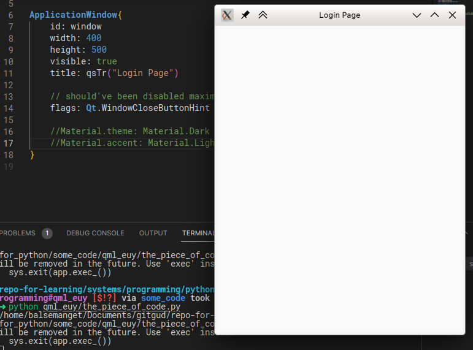
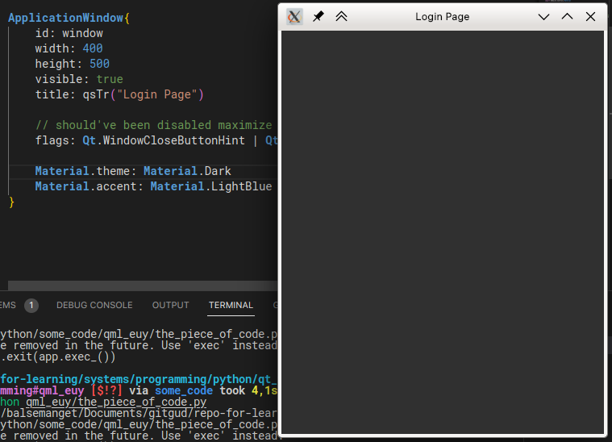
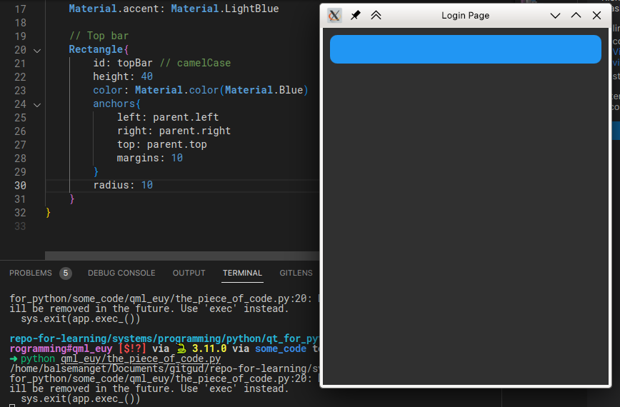
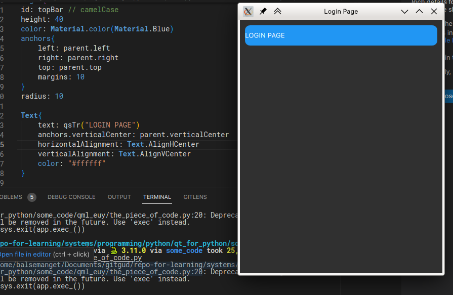
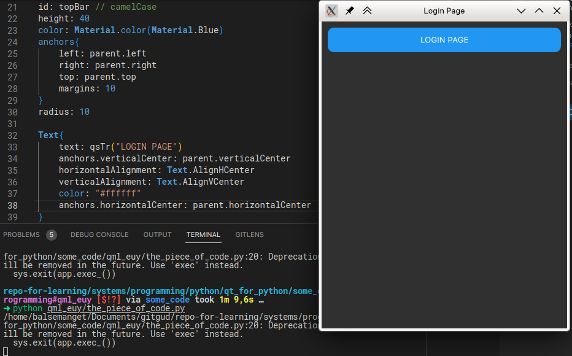
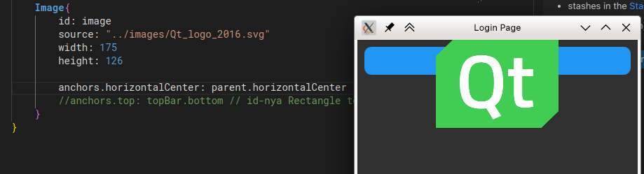
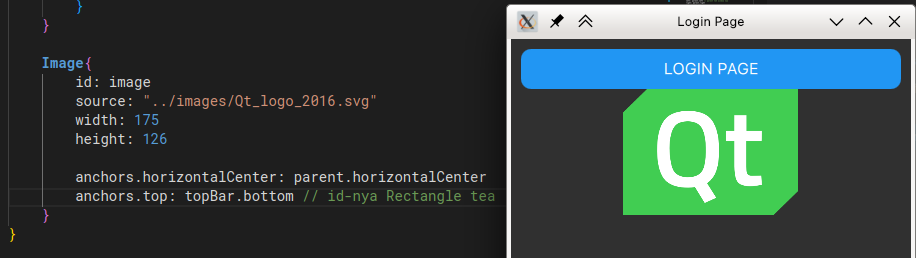
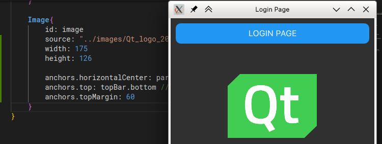

# QML_euy

## The main `.py` file

```python
import sys
import os

from PySide6.QtGui import QGuiApplication
from PySide6.QtQml import QQmlApplicationEngine

# Kalau di run nya lewat file ini langsung
if __name__ == "__main__":
    # maka jalanin kode-kode di bawah ini
    # to start the app
    app = QGuiApplication(sys.argv)
    # QML app engine
    engine = QQmlApplicationEngine()
    # Load .qml file
    engine.load(os.path.join(os.path.dirname(__file__), "qml/main.qml"))

    # Check if not valid then
    if not engine.rootObjects():
        sys.exit(-1)
    sys.exit(app.exec_())
```

> taken from [the_piece_of_code.py](the_piece_of_code.py)

## `main.qml`

### Import necessary modules

```qml
import QtQuick
import QtQuick.Window
import QtQuick.Controls
import QtQuick.Controls.Material
```

### Application Window

```qml
ApplicationWindow{
    id: window
    width: 400
    height: 500
    visible: true
    title: qsTr("Login Page")
}
```

The result:


Note:
> Use qsTr() for all Literal User Interface Strings, [link](https://doc.qt.io/qt-6/qtquick-internationalization.html)

### Flags

```qml
flags: Qt.WindowCloseButtonHint | Qt.WindowMinimizeButtonHint | Qt.CustomizeWindowHint | Qt.Dialog | Qt.WindowTitleHint
```

> should've been disabled maximize button cenah, but on my end don't, maybe KDE thing

### Theming

```qml
Material.theme: Material.Dark
Material.accent: Material.LightBlue
```

The result:


### Top bar

[Positioning with Anchors](https://doc.qt.io/qt-6/qtquick-positioning-anchors.html)

Note for me:
> Cari tahu apa units nya `cm` atau `px` kemungkinan besar px

```qml
Rectangle{
    id: topBar // camelCase
    height: 40
    color: Material.color(Material.Blue)
    anchors{
        left: parent.left // parent teh window nya
        right: parent.right
        top: parent.top
        margins: 10
    }
    radius: 10

    Text{
        text: qsTr("LOGIN PAGE")
        anchors.verticalCenter: parent.verticalCenter
        horizontalAlignment: Text.AlignHCenter
        verticalAlignment: Text.AlignVCenter
        color: "#ffffff"
        anchors.horizontalCenter: parent.horizontalCenter
        font.pointSize: 12
    }
}
```

The results:

- 
- 
- 

#### Add Image

```qml
Image{
    id: image
    source: "../images/Qt_logo_2016.svg" // a good idea to use qrc than this
    width: 175
    height: 126

    anchors.horizontalCenter: parent.horizontalCenter
    anchors.top: topBar.bottom // id-nya Rectangle tea
    anchors.topMargin: 60
}
```

The results:
- _image.png)
- 
- 
- 

Note:
> Use [The Qt Resource System](https://doc.qt.io/qt-5/resources.html), lebih better cenah, daripada misah-misah resource-nya.

## Source

[PySide6, Qt Quick, Material Design, VS Code And Python 3.9.1 - Tutorial Modern GUI - Part 1](https://www.youtube.com/watch?v=Jn0PpzB14Y8)
