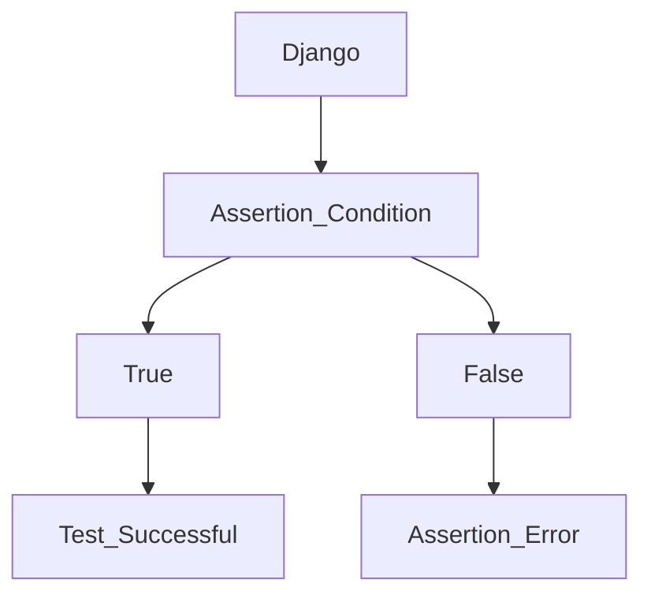
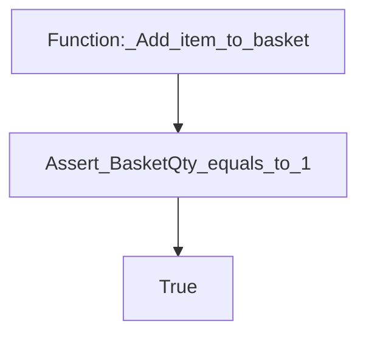

# Pytest | Django | Gentle Introduction, Setup and Start Testing

[Source](https://www.youtube.com/watch?v=LYX6nlECcro&list=PLOLrQ9Pn6caw3ilqDR8_qezp76QuEOlHY&index=1).

## Python Testing Frameworks

- Robot
- Pytest
- Unittest (Built-in)
- DocTest
- Nose2
- Testify

## Why Pytest?

1. Pytest is open-source.
2. Works with built-in Unittests.
3. Easy to start with and simple syntax.
4. Large community support.
5. Is highly extensible by using plugins.
6. Supports fixtures.

## Tutorial Prerequisite

1. Python Interpreter
2. Code Editor (VSCode)

## Tutorial Steps

_Skipped_.

## Getting Started

Taken from -> <https://pytest-django.readthedocs.io/en/latest/tutorial.html>.

1. `pip install pytest-django`
   - `pytest` will be automatically installed
2. Point `pytest` to your Django settings

   `pyproject.toml`:

   ```toml
   [tool.pytest.ini_options]
   DJANGO_SETTINGS_MODULE = "yourproject.settings"
   ```

   Optionally also add:

   ```toml
   [tool.pytest.ini_options]
   minversion = "8.0" # Mine, addition
   python_files = [
       "tests.py",
       "test_*.py",
       "*_tests.py",
   ]
   ```

3. Run `pytest`

   ```sh
   python manage.py test # ❌
   pytest # ✔️
   ```

## Example(s)

### 1

```python
import pytest

def test_example():
    assert 1 == 1
```

HINT:
> Put it on a file named `test_example.py`. Then run `pytest`.

### 2

```python
import pytest

def test_example1():
    assert 1 == 2 # IT WILL FAIL, -> `AssertionError`.
```

## A note

Mine:
> Don't forget to read/summarize from Python Crash Course book. Here's the [link](...), maintenance.

## Some diagrams

### 1



### 2



Mine, maintenance and learning note:
> It could be better.

## Back to the example 1

```python
def test_example()
    print("some output") # It will be printed with `pytest -rP`.
    assert 1 == 1
```

## ...

...
